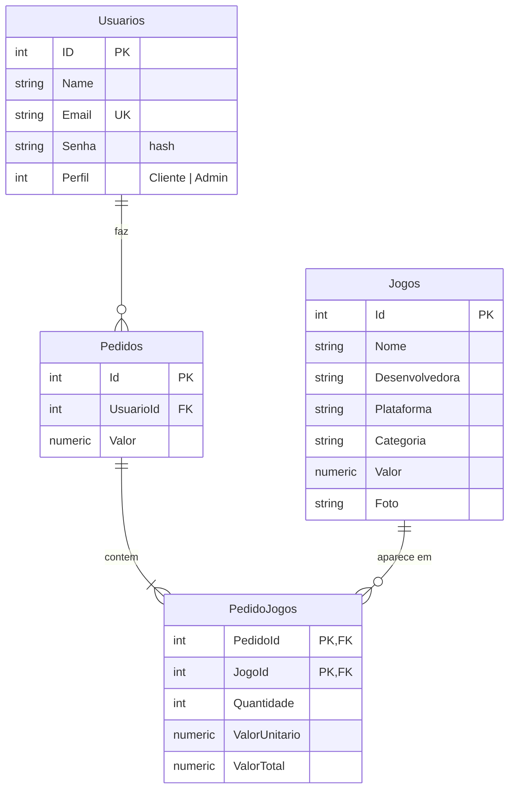
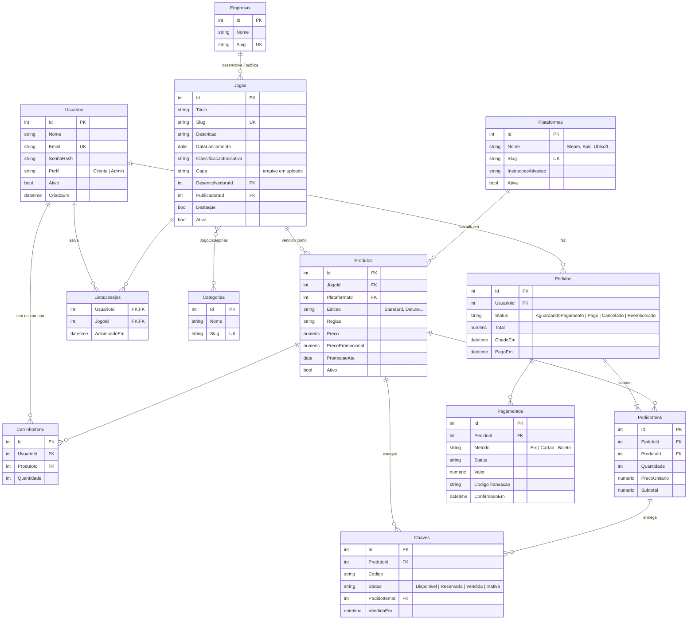

# Modelo de dados

Este documento compara o modelo do curso com o que uma loja de chaves precisa e descreve o modelo proposto para o CLOUUD, junto com o plano para chegar nele.

**Situação:** etapa 1 (catálogo) concluída. Veja o [plano](#4-plano-de-implementação).

## 1. Modelo do curso (ponto de partida)

### O que o diagrama resolve bem

- **Pedido e itens separados:** o pedido tem vários jogos, e cada item guarda a quantidade e o preço. É o modelo clássico de qualquer loja.
- **Preço gravado no item:** `ValorUnitario` guarda o preço do momento da compra. Se o preço do jogo mudar depois, o pedido antigo continua certo.

### O que falta para uma loja de chaves

| Limitação | Problema na prática |
|---|---|
| **Não existe tabela de chaves** | É o produto da loja. Sem ela não há estoque, não dá para saber o que foi vendido nem entregar a chave ao cliente. |
| **Plataforma é um texto dentro do jogo** | O mesmo jogo não pode ser vendido na Steam **e** na Epic com preços e estoques diferentes. Também não há como filtrar por plataforma com segurança ("Steam", "steam" e "STEAM" contam como três). |
| **Categoria e desenvolvedora são texto** | Um jogo só pode ter uma categoria, e erros de digitação viram categorias novas. |
| **Pedido sem status nem data** | Não dá para saber se o pedido foi pago, cancelado ou reembolsado, nem quando foi feito. |
| **Sem pagamento** | Não fica registrado como foi pago (Pix, cartão, boleto) nem o código da transação. |
| **Sem carrinho** | O cliente não consegue juntar vários jogos antes de pagar. |
| **Sem promoções** | O preço promocional (o "de R$ 249,90 por R$ 124,95" da Nuuvem e da Green Man Gaming) não tem onde ficar. |

## 2. Modelo proposto

A ideia central é separar o **jogo** (título, descrição, capa) do **produto**, que é o que realmente se vende: um jogo, em uma plataforma, em uma edição, com preço próprio. Cada produto tem seu **estoque de chaves**, e cada chave é vendida uma única vez.

### Tabelas

| Tabela | Para que serve | Regras garantidas pelo banco |
|---|---|---|
| **Usuarios** | Clientes e administradores | E-mail único; senha só como hash |
| **Plataformas** | Onde a chave é ativada (Steam, Epic Games, Ubisoft Connect, Battle.net, EA App, GOG, Xbox, PlayStation, Nintendo). Guarda o passo a passo de ativação mostrado com a chave | Slug único |
| **Categorias** + **JogoCategorias** | Gêneros (Ação, RPG, Luta...). Um jogo pode ter várias | Par jogo/categoria único |
| **Empresas** | Desenvolvedoras e publicadoras | Slug único |
| **Jogos** | Informações do jogo: título, descrição, capa, lançamento | Slug único (usado na URL: `/jogo/elden-ring`) |
| **Produtos** | O que é vendido: jogo + plataforma + edição, com preço e promoção | Não repete jogo + plataforma + edição; preço promocional menor que o preço |
| **Chaves** | Estoque. Cada linha é uma chave de ativação | Mesma chave não entra duas vezes no mesmo produto |
| **CarrinhoItens** | Produtos que o cliente separou antes de pagar | Um produto aparece uma vez no carrinho (a quantidade aumenta) |
| **ListaDesejos** | Jogos que o cliente quer acompanhar | Par usuário/jogo único |
| **Pedidos** | A compra, com status e datas | FK para o usuário |
| **PedidoItens** | Itens da compra (o `Pedido_Jogo` do diagrama, agora apontando para o produto) | Quantidade maior que zero |
| **Pagamentos** | Tentativas de pagamento do pedido (simulado no início) | FK para o pedido |

### Decisões importantes

- **Ciclo de vida da chave:** a chave fica `Disponivel` no estoque. Quando o pedido é criado, ela passa para `Reservada`, para ninguém mais comprar. Com o pagamento aprovado, vira `Vendida` e aparece para o cliente. Se o pedido for cancelado antes do pagamento, a chave volta a ficar `Disponivel`. Se um pedido pago for reembolsado, ela vira `Inativa`, porque o cliente já viu o código.
- **Preço congelado:** `PedidoItens.PrecoUnitario` guarda o preço da hora da compra, como no diagrama original.
- **Dinheiro em `numeric(10,2)`:** evita erros de arredondamento.
- **Status como texto** (`'Pago'`, `'Disponivel'`): o banco fica legível sem precisar consultar o código.
- **Desativar em vez de apagar:** jogos e produtos com vendas são desativados (`Ativo = false`) e somem da loja sem perder o histórico dos pedidos.
- **`PedidoItens` com `Id` próprio:** o diagrama usa a chave composta (pedido, jogo). Aqui cada chave vendida precisa apontar para o item em que foi entregue, e isso fica mais simples com um `Id`. O par (pedido, produto) continua único.

### O que ficou de fora (pode entrar depois)

- **Cupons de desconto:** tabela `Cupons`, com o cupom referenciado no pedido.
- **Avaliações dos jogos:** tabela `Avaliacoes` (usuário, jogo, nota, comentário).
- **Galeria de imagens do jogo:** tabela `JogoImagens`.

## 3. Do modelo atual para o proposto

A migration de cada etapa converte os dados que já existem:

| Hoje | Vai para |
|---|---|
| `Jogos.Plataforma` (texto) | Linha em `Plataformas` + um `Produto` para o jogo nessa plataforma (nomes comuns como "Epic", "Uplay" ou "obsofit" apontam para a plataforma já cadastrada) |
| `Jogos.Valor` | `Produtos.Preco` |
| `Jogos.Categoria` (texto) | Linha em `Categorias` + vínculo em `JogoCategorias` ("Ação, Aventura" vira duas categorias) |
| `Jogos.Desenvolvedora` (texto) | Linha em `Empresas` + `Jogos.DesenvolvedoraId` |
| `Jogos.Nome` | `Jogos.Titulo` (e `Slug` gerado a partir dele) |
| `Jogos.Foto` | `Jogos.Capa` |
| `Pedidos` | `Pedidos` + `Status`, `CriadoEm`, `PagoEm` |
| `PedidoJogos` | `PedidoItens` (apontando para o produto do jogo) |

## 4. Plano de implementação

Cada etapa é um commit, com as telas funcionando no final:

1. ✅ **Catálogo** (migration `Catalogo`): `Plataformas`, `Categorias`, `Empresas`, `Jogos` reformulado e `Produtos`. Telas do admin para jogos e produtos (com preço promocional) e vitrine mostrando plataforma, preço e desconto.
2. **Estoque de chaves:** tabela `Chaves` e telas do admin para importar chaves (colar uma por linha) e ver o estoque de cada produto.
3. **Compra:** `CarrinhoItens`, `Pedidos` com status, `PedidoItens` e `Pagamentos`. Inclui carrinho, checkout com pagamento simulado, entrega da chave, "Meus pedidos" e "Minhas chaves".
4. **Lista de desejos.**
