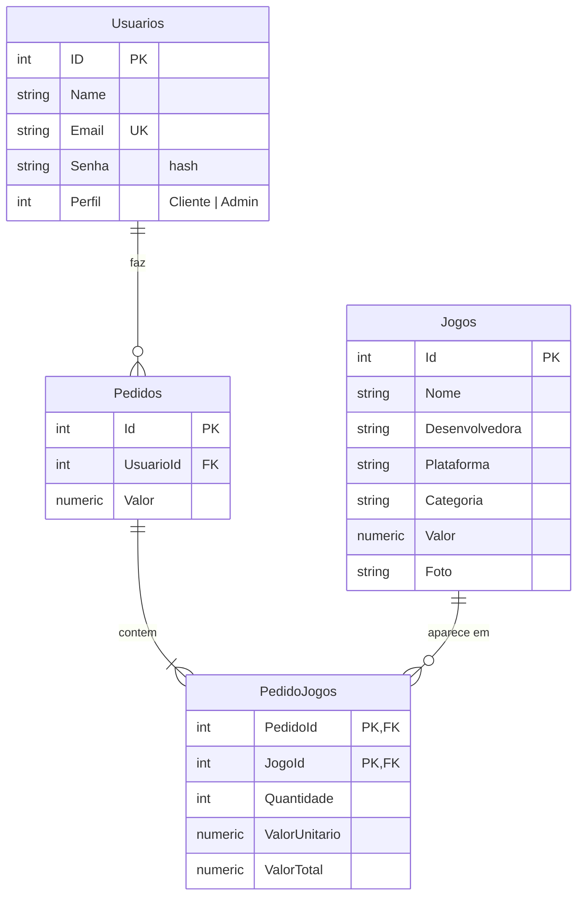
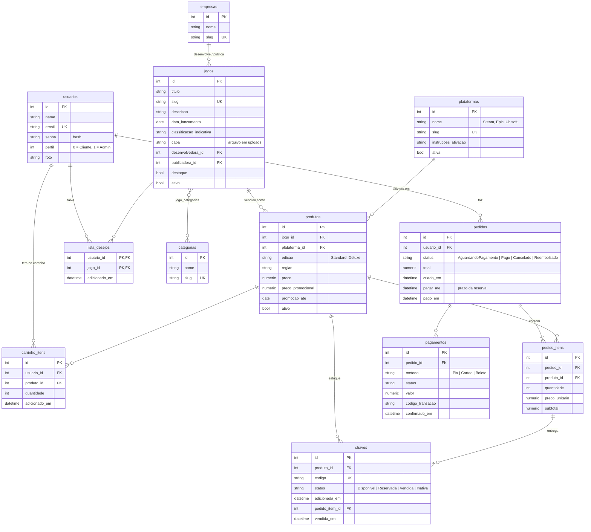

# Modelo de dados

Este documento compara o modelo do curso com o que uma loja de chaves precisa e descreve o modelo proposto para o CLOUUD, junto com o plano para chegar nele.

**Situação:** as quatro etapas do plano estão concluídas (catálogo, estoque de chaves, compra e lista de desejos). Veja o [plano](#4-plano-de-implementação).

## 1. Modelo do curso (ponto de partida)

### O que o diagrama resolve bem

- **Pedido e itens separados:** o pedido tem vários jogos, e cada item guarda a quantidade e o preço. É o modelo clássico de qualquer loja.
- **Preço gravado no item:** `ValorUnitario` guarda o preço do momento da compra. Se o preço do jogo mudar depois, o pedido antigo continua certo.

### O que falta para uma loja de chaves

| Limitação | Problema na prática |
|---|---|
| **Não existe tabela de chaves** | É o produto da loja. Sem ela não há estoque, não dá para saber o que foi vendido nem entregar a chave ao cliente. |
| **Plataforma é um texto dentro do jogo** | O mesmo jogo não pode ser vendido na Steam **e** na Epic com preços e estoques diferentes. Também não há como filtrar por plataforma com segurança ("Steam", "steam" e "STEAM" contam como três). |
| **Categoria e desenvolvedora são texto** | Um jogo só pode ter uma categoria, e erros de digitação viram categorias novas. |
| **Pedido sem status nem data** | Não dá para saber se o pedido foi pago, cancelado ou reembolsado, nem quando foi feito. |
| **Sem pagamento** | Não fica registrado como foi pago (Pix, cartão, boleto) nem o código da transação. |
| **Sem carrinho** | O cliente não consegue juntar vários jogos antes de pagar. |
| **Sem promoções** | O preço promocional (o "de R$ 249,90 por R$ 124,95" da Nuuvem e da Green Man Gaming) não tem onde ficar. |

## 2. Modelo proposto

> **Nomes no banco:** tabelas, colunas, chaves e índices ficam em minúsculo snake_case (`pedido_itens.preco_unitario`), para o SQL escrito à mão não precisar de aspas. No código C# as classes e propriedades continuam em PascalCase (`PedidoItem.PrecoUnitario`); a conversão é feita em `Data/NomesSnakeCase.cs`.

A ideia central é separar o **jogo** (título, descrição, capa) do **produto**, que é o que realmente se vende: um jogo, em uma plataforma, em uma edição, com preço próprio. Cada produto tem seu **estoque de chaves**, e cada chave é vendida uma única vez.

### Tabelas

| Tabela | Para que serve | Regras garantidas pelo banco |
|---|---|---|
| **usuarios** | Clientes e administradores | E-mail único; senha só como hash |
| **plataformas** | Onde a chave é ativada (Steam, Epic Games, Ubisoft Connect, Battle.net, EA App, GOG, Xbox, PlayStation, Nintendo). Guarda o passo a passo de ativação mostrado com a chave | Slug único |
| **categorias** + **jogo_categorias** | Gêneros (Ação, RPG, Luta...). Um jogo pode ter várias | Par jogo/categoria único |
| **empresas** | Desenvolvedoras e publicadoras | Slug único |
| **jogos** | Informações do jogo: título, descrição, capa, lançamento | Slug único (usado na URL: `/jogo/elden-ring`) |
| **produtos** | O que é vendido: jogo + plataforma + edição, com preço e promoção | Não repete jogo + plataforma + edição; preço promocional menor que o preço |
| **chaves** | Estoque. Cada linha é uma chave de ativação | Código único em toda a loja (a mesma chave não entra duas vezes, nem em produtos diferentes); status só com os quatro valores válidos |
| **carrinho_itens** | Produtos que o cliente separou antes de pagar | Um produto aparece uma vez no carrinho (a quantidade aumenta) |
| **lista_desejos** | Jogos que o cliente quer acompanhar | Par usuário/jogo único |
| **pedidos** | A compra, com status, datas e prazo para pagar | FK para o usuário; status só com os quatro valores válidos; total não negativo |
| **pedido_itens** | Itens da compra (o `Pedido_Jogo` do diagrama, agora apontando para o produto) | Quantidade maior que zero |
| **pagamentos** | Tentativas de pagamento do pedido (simulado no início) | FK para o pedido |

### Decisões importantes

- **Ciclo de vida da chave:** a chave fica `Disponivel` no estoque. Quando o pedido é criado, ela passa para `Reservada`, para ninguém mais comprar. Com o pagamento aprovado, vira `Vendida` e aparece para o cliente. Se o pedido for cancelado antes do pagamento, a chave volta a ficar `Disponivel`. Se um pedido pago for reembolsado, ela vira `Inativa`, porque o cliente já viu o código.
- **Prazo de pagamento:** as chaves ficam reservadas por 30 minutos (`Loja:MinutosParaPagar` no `appsettings.json`). Um serviço em segundo plano cancela a cada minuto os pedidos vencidos, e a tentativa de pagar um pedido vencido também o cancela.
- **Duas compras ao mesmo tempo:** a reserva usa `SELECT ... FOR UPDATE SKIP LOCKED`, então duas pessoas comprando a última chave nunca recebem a mesma; uma delas recebe o aviso de que o produto esgotou. O banco também garante que chave reservada ou vendida sempre tem pedido (`ck_chaves_pedido`).
- **Preço congelado:** `pedido_itens.preco_unitario` guarda o preço da hora da compra, como no diagrama original.
- **Dinheiro em `numeric(10,2)`:** evita erros de arredondamento.
- **Status como texto** (`'Pago'`, `'Disponivel'`): o banco fica legível sem precisar consultar o código.
- **Desativar em vez de apagar:** jogos e produtos com vendas são desativados (`ativo = false`) e somem da loja sem perder o histórico dos pedidos.
- **`pedido_itens` com `id` próprio:** o diagrama usa a chave composta (pedido, jogo). Aqui cada chave vendida precisa apontar para o item em que foi entregue, e isso fica mais simples com um `id`. O par (pedido, produto) continua único.

### O que ficou de fora (pode entrar depois)

- **Cupons de desconto:** tabela `cupons`, com o cupom referenciado no pedido.
- **Avaliações dos jogos:** tabela `avaliacoes` (usuário, jogo, nota, comentário).
- **Galeria de imagens do jogo:** tabela `jogo_imagens`.

## 3. Do modelo atual para o proposto

A migration de cada etapa converte os dados que já existem:

| Antes (modelo do curso) | Agora |
|---|---|
| `jogos.plataforma` (texto) | Linha em `plataformas` + um `produto` para o jogo nessa plataforma (nomes comuns como "Epic", "Uplay" ou "obsofit" apontam para a plataforma já cadastrada) |
| `jogos.valor` | `produtos.preco` |
| `jogos.categoria` (texto) | Linha em `categorias` + vínculo em `jogo_categorias` ("Ação, Aventura" vira duas categorias) |
| `jogos.desenvolvedora` (texto) | Linha em `empresas` + `jogos.desenvolvedora_id` |
| `jogos.nome` | `jogos.titulo` (e `slug` gerado a partir dele) |
| `jogos.foto` | `jogos.capa` |
| `pedidos.valor` | `pedidos.total`; os pedidos antigos ficam como `Pago`, com a data da migration |
| `pedido_jogos` | `pedido_itens` (apontando para o produto do jogo; jogo sem produto ganha um produto inativo na plataforma "Não informada") |

## 4. Plano de implementação

Cada etapa é um commit, com as telas funcionando no final:

1. ✅ **Catálogo** (migration `Catalogo`): `plataformas`, `categorias`, `empresas`, `jogos` reformulado e `produtos`. Telas do admin para jogos e produtos (com preço promocional) e vitrine mostrando plataforma, preço e desconto.
2. ✅ **Estoque de chaves** (migration `Estoque`): tabela `chaves` e telas do admin para importar chaves (colar uma por linha) e ver o estoque de cada produto.
3. ✅ **Compra** (migration `Compra`): `carrinho_itens`, `pedidos` com status, `pedido_itens` e `pagamentos`. Inclui carrinho, checkout com pagamento simulado, entrega da chave, "Meus pedidos" e "Minhas chaves".
4. ✅ **Lista de desejos** (migration `ListaDesejos`): tabela `lista_desejos`, coração na vitrine, página "Lista de desejos" com preço, promoção e estoque de cada plataforma, e a procura de cada jogo no estoque do admin.

Entre as etapas 3 e 4, a migration `NomesSnakeCase` renomeou tudo no banco para minúsculo snake_case, sem alterar nenhum dado.
